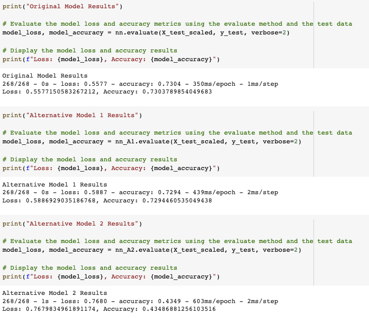

# Successful Business Prediction

The venture capital firm Alphabet Soup creates a neural network model application  that predicts whether applicants will be successful if funded with them.

This application is based on a CSV file containing more than 34,000 organizations that have received funding from Alphabet Soup over the years. The CSV file contains a variety of information about each business, including whether or not it ultimately became successful. The application creates a binary classifier model that will predict whether an applicant will become a successful business.

---

## Technologies

This project was developed with python 3.7 with the following packages:

* [pandas](https://github.com/pandas-dev/pandas) - Providing fast, flexible, and expressive data structures designed to make working with "relational" or "labeled" data both easy and intuitive.

* [TensorFlow](https://github.com/tensorflow/tensorflow) - TensorFlow is an end-to-end open source platform for machine learning. It has a comprehensive, flexible ecosystem of tools, libraries, and community resources that lets researchers push the state-of-the-art in ML and developers easily build and deploy ML-powered applications.

* [SKLearn](https://github.com/scikit-learn/scikit-learn) - SPython module for machine learning built on top of SciPy and is distributed under the 3-Clause BSD license.

Also, I used [Google Colab](https://colab.research.google.com/) notebook to develope it.

---

## Installation Guide

Before running the application it is necessary to install the following dependencies.

* pandas
```conda install pandas``` 
* Jupyter Notebook
```pip install notebook```
* tensorflow
```pip install tensorflow```
* sklearn
```pip install -U scikit-learn```

---

## Usage

To use the application you will need to clone the repo into your machine, navigate on terminal into it and open your [Jupyter Lab](https://github.com/jupyter/notebook) to run the file **venture_funding_with_deep_learning.ipynb**. 

Bellow you can find a brief summary of the model evaluation (loss and accuracy) in the original scenario and two possible ones.

 

---

## Contributors

This was a project developed as a group during a Fintech Bootcamp hosted by UC Berkley Extension. 

---

## License
MIT


HAPPY CODING :) 

